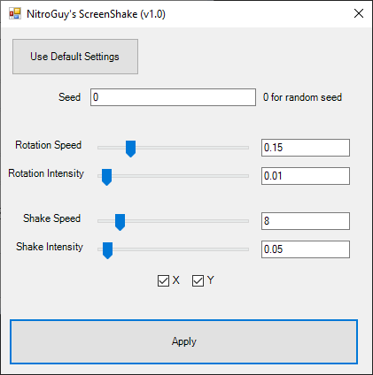

# Vegas_ScreenShake
A screen shake script/plugin for MAGIX VEGAS Pro 18 (although it should also work on previous versions)

---

## NOTE: This repo is not maintained and I will not be responding to any posted issues. Sorry :/

---

This script accepts user settings from a Windows Forms dialog and adds a "screen shake" or "camera shake" effect to all currently selected video clips.
More specifically, it adds a VEGAS Picture In Picture effect with animations to its Location and Angle parameters.

It uses [FastNoiseLite](https://github.com/Auburn/FastNoiseLite) for noise generation

## Install
 
Grab the latest .exe binary from the [releases tab](https://github.com/NitroGuy10/Vegas_ScreenShake/releases/latest).
Move the .exe file into the Script Menu folder of your VEGAS installation.
Usually, it's something like C:\\Program Files\\VEGAS\\VEGAS Pro 18.0\\Script Menu

From Vegas, you can find it under Tools > Scripting > ScreenShake

You can also add it to your toolbar by double-clicking on the toolbar, choosing ScreenShake from the left menu, and clicking "Add ->".
